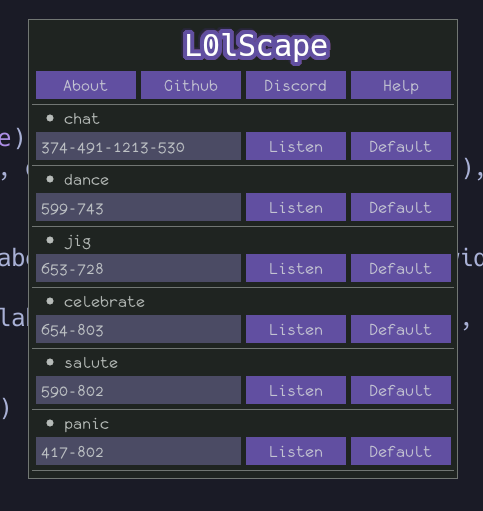

# 
l0lscape (Styilized "**l0lsc4p3**") is an incredibly useless collection of scripts to automate **only** pointless activities in Jagex's MMORPG **RuneScape**.

Currently the focus of this project is to add a bot to entertain at the **Grand Exchange** in one world only.

## L0lscape Configurator-inator

Since **Jagex** has made such an amazing interface experience for the game, it's safe to assume **every single person** has customized their interface a bit. If you want to run L0lscape on your own machine, you'll need to change these values.

### To do so:
* Select listen on whichever node you want to change
* Hover over the location of that element on your RuneScape client and press Mouse9 (Forward side button)
* Nice. You pwned.

### For regions like `chat`, instead of simply click Mouse9 one time, you'll click it twice:
* Click once at the top left of whichever region you're wanting to select
* Click once on the bottom right of whichever region you're wanting to select
* Nice. You pwned.
 
## Ok but why
Because writing this is fun, but ruining the game is not fun. Collection millions of uncooked rabbits doesn't ruin anyone's experience. Because it's pointless.

## Can't someone just repurpose this codebase to actual game-ruining routines?
If anyone knows enough to repurpose this codebase they know enough to make it themselves anyway.

